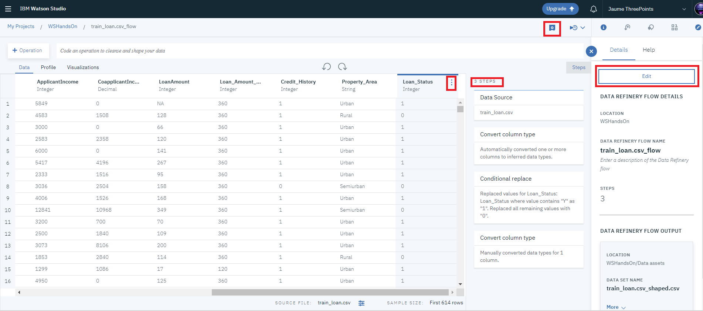
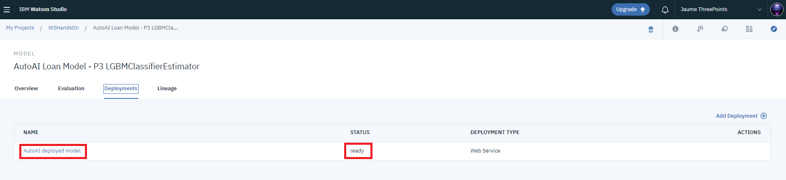

# Predict loan eligibility using IBM Watson Studio

Loans are the core business of loan companies. The main profit comes directly from the loan’s interest. The loan companies grant a loan after an intensive process of verification and validation. However, they still don’t have assurance if the applicant is able to repay the loan with no difficulties.<br/>

In this tutorial, we’ll build a predictive model to predict if an applicant is able to repay the lending company or not. We will prepare the data using Watson Studio's Refinery and then build a model in two ways: using SPSS Modeler and using the new AutoAI feature of Watson Studio. Finally, we will deploy a web application that will use either of these two models.<br/>

## Learning objectives
After completing this tutorial, you’ll understand how to:
- Add and prepare your data
- Build a machine learning model using two different techniques
- Save & Deploy the models
- Use the models from a web application

## Prerequisites
In order to complete this tutorial, you will need:
- [IBM Cloud](https://www.ibm.com/cloud/) account.
- [Object Storage](https://cloud.ibm.com/catalog/services/cloud-object-storage) Service.
- [Watson Studio](https://cloud.ibm.com/catalog/services/watson-studio) Service.
- [Machine Learning](https://cloud.ibm.com/catalog/services/machine-learning) Service.
<br/>
Services will be deployed in the next steps.


## Estimated time
The overall time of reading and following this tutorial is approximately one hour.

## Dataset

The dataset is taken from from [Analytics Vidhya](https://datahack.analyticsvidhya.com/contest/practice-problem-loan-prediction-iii/#data_dictionary) but data is added to the `data` folder for your convenience.

### Variable Description

The format of the training data in `train_loan.csv` is:

- Loan_ID Unique Loan ID
- Gender Male/ Female
- Married Applicant married (Y/N)
- Dependents Number of dependents
- Education Applicant Education (Graduate/ Under Graduate)
- Self_Employed Self employed (Y/N)
- ApplicantIncome Applicant income
- CoapplicantIncome Coapplicant income
- LoanAmount Loan amount in thousands
- Loan_Amount_Term Term of loan in months
- Credit_History Credit history meets guidelines
- Property_Area Urban/ Semi Urban/ Rural
- Loan_Status Loan approved (Y/N) --> This is the target to predict. `test_loan.csv` file does not provide this field.

## Steps
1. [Create a project in Watson Studio](#step-1-create-a-project-in-watson-studio)
2. [Upload the dataset to Watson Studio](#step-2-upload-the-dataset-to-watson-studio)
3. [Refine the train dataset, using Watson Studio Refinery capability](#step-3-refine-the-train-dataset-using-watson-studio-refinery-capability)
4. [Build a visual flow model and deploy it as a web service with no coding](#step-4-build-a-visual-flow-model-and-deploy-it-as-a-web-service-with-no-coding)
5. [Build an alternative model using AutoAI capabilities of Watson Studio & Watson Machine Learning](#step-5-build-an-alternative-model-using-autoai-capabilities-of-watson-studio-watson-machine-learning


### Step 1: Create a project in Watson Studio
If it does not exist yet, go to the IBM Cloud Catalog and create an instance of Watson Studio, selecting the Lite plan and a location such as `London` or `Dallas`, for example.
<br/><br/><br/><br/>
Navigate to either `https://eu-gb.dataplatform.cloud.ibm.com` or `https://dataplatform.cloud.ibm.com`, depending if you want to work in London or Dallas, and log in with your IBM Cloud credentials.
<br/><br/><br/><br/>
From that Watson Studio main page, click on `New project`. Choose `Create an empty project`. Once you enter your project name, if there is no `Cloud Object Storage` associated to the project, click on `Add` to select a new storage service.
<br/><br/><br/><br/>
A new tab will open into the new Cloud Object Storage (COS) service. Select `New`, ensure the selected plan is `Lite` and press `Create`. A new pop up will show the creation confirmation. You may change the name of the service instance, and then press `Create`
<br/><br/><br/><br/>
The tab will be closed and you will return to the Watson Studio project creation screen. Just press `Refresh` to load the newly created COS instance. Finally, press the `Create` button to create the project in Watson Studio.

### Step 2: Upload the dataset to Watson Studio
In the new project screen, select the `Assets` menu, on the top.
It will open the `Find and add data` section on the right-side panel. In the `Load` area, drag and drop the two dataset files (`train_loan.csv` and `test_loan.csv` files) from your computer, under the `data` directory of the git clone, to that area.
<br/><br/><br/><br/>

### Step 3: Refine the train dataset, using Watson Studio Refinery capability

#### Step 3.1. Open the train dataset 
- On the asset page, click on the `train_loan.csv` data asset. A new screen will open
<br/><br/><br/<br/>
You can see that all the columns have been identified as `strings`. Although there are different ways to fix it, let's use the Refinery capability to adjust the data without the need of any programming.

#### Step 3.2. Refine the dataset
- Press the `Refine` button, on the top right. The tool will start, analyze the data set and present a new screen. You will note that a list of transformation steps has been created and an initial step of `Convert column type`has been automatically added. This step has adjusted the types of all columns to its best-fit type. So it has converted `Application Income` to `Integer`, `CoaplicantIncome` to `Decimal` and `LoanAmount`, `Loan_Amount_Term` and `Credit_History` all `Integer`. You can re-visit how the file is transformed on each step.
<br/><br/><br/><br/>
- Now, select the column `Loan_Status`, which is the target column we will predict, and press the `Operations` button.
- Scroll down under `Organize` and select `Conditional Replace`
<br/><br/><br/><br/>
- Add two conditions. One where the field `is equal to` `Y` and replace by `1`. Replace any remaining values with value `0`. Press `Apply` button, at the bottom of the page. A new step is created. It says: `Replaced values for Loan_Status: Loan_Status where value contains "Y" as "1". Replaced all remaining values with "0".`
- Finally, convert the column type for `Loan_Status` from `string` to `integer`. To do that, press the context button of the column, then select `Convert Column Type` and select the suggested type `Integer` 
<br/><br/><br/><br/>
There will be 3 steps recorded.
- Press the `save` button, and then the `edit` button, to adjust the output options.
<br/><br/><br/><br/>
- In the new screen, press the `edit` icon to change the name of the output file. Put `train_shaped.csv`. We will use this file later. You can also see the tool supports different file formats. We will leave CSV as it is.
- Press `save` button to save the new names and then press the `Done` button to return back to the Refinery screen.
- Press the `save` button again, and then the `play` button (select `Save and create a job`)
<br/><br/><br/><br/>
- A new `job creation` screen will open. Here it is possible to configure a single run or schedule a recurrent run of the transformation flow. Put a name for the job and finally press `Create and Run` in the bottom right part of the screen.
<br/><br/><br/><br/>
- A new job execution window will show. It will show the job is running. Just return to the project assets page. You will see a new data asset named `train_shaped.csv`. You can preview it and validate that all the changes defined have been applied.
<br/><br/><br/><br/>

### Step 4: Build a visual flow model and deploy it as a web service with no coding
#### Step 4.1. Create SPSS modeler flow
- On the same Assets page, select `Add to Project` and from the different options select `Modeler flows`.
- Under the `New Modeler Flow` screen, name your modeler flow as `Loan Eligibility Predictive model`, and ensure the selected runtime is `IBM SPSS Modeler`
- Click Create.

#### Step 4.2. Add and prepare data
- Add data to the canvas using the `Data Asset` node.
- Double click on the node and click `Change Data Asset` to open the Asset Browser. Select `train_shaped.csv` then click `OK` and `Save`.
<br/><br/><br/><br/>

Let’s look into the summary statistics of our data using the `Data Audit` node.

- Drag and drop the `Data Audit` node, and connect it with the `Data Asset` node. After running the node you can see your audit report on right side panel.
<br/><br/><br/><br/>

We can see that some columns have missing values. Let’s remove the rows that have null values using the `Select` node.

- Drag and drop the `Select` node, connect it with the `Data Asset` node and right click on it and open the node.
- Select discard mode and provide the below condition to remove rows with null values.
```
(@NULL(Gender) or @NULL(Married) or @NULL(Dependents) or @NULL(Self_Employed) or @NULL(LoanAmount) or @NULL(Loan_Amount_Term) or @NULL(Credit_History))
```
<br/><br/><br/><br/>

Now our data is clean, and we can proceed with building the model.

#### Step 4.3. Configure variables type
- Drag and Drop the `Type` node to configure variables type, from `Field Operations` palette.
- Double click the node or right click to open it.
- Choose `Configure Types` to `read` the metadata.
- Change the Role from the drop down menu of [Loan_Status] from `Input` to `Target`.
- Change the Role drop down menu of [LoanID] from `none` to `Record ID`.
- Click `Save`.
<br/><br/><br/><br/>

#### Step 4.4. Build a machine learning model
The model predicts the loan eligibility of two classes (Either Y:Yes or N:No). Thus, the choice of algorithms fell into Bayesian networks since it’s known to give good results for predicting classification problems.
- Split data into training and testing sets using the `Partition` node, from `Field Operations` palette. (we are not going to use the `test_loan.csv` as that file does not contain a target to validate the training) 
- Double click the `Partition` node to customize the partition size into `80:20`, change the ratio in the `Training Partition` to `80` and `Testing Partition` to `20`.
<br/><br/><br/><br/>

- Drag and drop the `Bayes Net` node from the `Modeling` Palette.
- Double click the node to have a look to the settings. This time we are not going to touch anything. 
<br/><br/><br/><br/>

- Run your `Bayesian Network` node, then you’ll see your model in an orange colored node.
<br/><br/><br/><br/>

#### Step 4.5. View the model
- Right click on the orange colored node, then click on `View`.
- Now you can see the `Network Graph` and other model information here.
<br/><br/><br/><br/>

#### Step 4.6. Evaluate the performance of the model
- Drag and drop the `Analysis` node from the `Output` section, and connect it with the model.
- After running the node, you can see your analysis report on the right side panel.
<br/><br/><br/><br/>

The analysis report shows we have achieved `75.22% accuracy` (it might be different) on our `test data partition` with this model. At the end, you can build more models within the same canvas until you get the result you want.<br/>

#### Step 4.7. Prepare the inference flow to be deployed.
Let's build the inference flow with the data structure that will be used during inference, which is different to that used for training.
- As in step 4.2, add data to the canvas using the `Data Asset` node.
- Double click on the new node and click `Change Data Asset` to open the Asset Browser. Select `test_loan.csv` then click `OK` and `Save`.
- Delete the connection from `Partition` to the model `Loan Status` (yellow node), by selecting it and opening the contextual menu pressing the right mouse button and pressing `delete`.
- Connect the new `Data Asset` node to the `Loan Status`model (yellow node).
- Drag and drop the `Table` node from the `Output` section, and connect it with the model (yellow node).
<br/><br/><br/><br/>

#### Step 4.8. Save & Deploy the inference flow.
Right-click on the `Table` node and select `Save branch as a model`. If a Watson Machine Learning instance does not exist in the project, then the following screen may appear. Click on `Create a new Watson Machine Learning service instance`. 
<br/><br/><br/><br/>
A new tab will open to create a new instance of Watson Machine Learning. 
- Select `New` and select the Lite plan and a location such as `London` or `Dallas`, ideally the same you chose for Watson Studio. 
- Then press `Create`. A new dialog pops up.
- Review the options, change the `Service name` if you want, and press `Confirm`.
<br/><br/><br/><br/>
The tab will close and you will go back to the SPSS Flow screen. Just repeat the right-click on the `Table` node and select `Save branch as a model`. The `Save Model` screen will open.
<br/><br/><br/><br/>
- Put a meaningfull model name, review that the `Table` branch is selected and finally, press `Save`
You will see a confirmation message and when accepted you will return back to the SPSS Flow Editor. Just click on the project name on the top and return to the Asset page.
In the Asset page under `Watson Machine Learning models` you can access your saved model.
<br/><br/><br/><br/>
- Select the model. 
A new screen opens. There you can see some model information, as well as the input and output schema.
<br/><br/><br/><br/>
- Select the `Deployments` tab.
- Select the `Add Deployment` link.
- Add a name for the deployment. (ej. `SPSS Deploy model`)
- Click on `Save`
It will take some time, and you may need to refresh the screen before showing:
<br/><br/><br/><br/>
**YES! IT HAS FAILED!!** Why?<br/>
Well, **guessing it is part of the exercise!**<br/>
<br/>
Let's see the error message...
- Select the `SPSS Deploy model` (or whatever the name you gave to the model) link
- In the new screen, select the `Details` tab, and check the error message:
<br/><br/><br/>
Think on it and answer the questions in the exercise guide!
<br/>

### Step 5: Build an alternative model using AutoAI capabilities of Watson Studio & Watson Machine Learning
#### Step 5.1. Launch the AutoAI model generation
- On the Assets page, select `Add to Project` and from the different options select `AutoAI experiment`.
The following screen appears
<br/><br/><br/>
- Put a name for the model 
- Check the WML instance created in the previous step is selected and press `Create`
In the new screen, select `Select from Project` to select a data asset as the data to train the model. Currently this is limited to a single CSV file. Soon it will also support selecting a database connection, including table joins.
A new pop up dialog appears.
<br/><br/><br/>
- Select `train_shaped.csv`
- Press `Select Asset`
The file is added as a data source, as shown in the next screen.
<br/><br/><br/>
- In the right column, select the column name that contains the target to predict (`Loan_Status`)
- Press `Experiment Settings` to further customize the experiment.
<br/><br/><br/>
- In the configuration screen, adjust the train / test split to 85/15
- Uncheck the Loan_ID as it is not a valid feature. It is only the record id.
- Press `Prediction` to see the available configuration, although do not change anything.
- Press `General` to see the available configuration, although do not change anything.
- Finally, press `Save settings`
When the browser returns to the previous screen, press `Run experiment`

#### Step 5.2. Observe while the AutoAI works...and explore results.
This is the initial screen, when AutoAI starts its calculation.
<br/><br/><br/>
After some minutes, the animation will evolve and when it finishes will be similar to this other picture
<br/><br/><br/>
- Click on `Pipeline comparison` to visualize more metrics comparing the four experiments.
<br/><br/><br/>
- Click on `Holdout` to visualize the metrics with the 15% of holdout data instead of crosvalidation. (results are slightly worse)
- Explore the comparison and then click on the first and best experiment (`Pipeline 3` in this case).
Another screen will open.
<br/><br/><br/>
- Check the different sections. The picture above shows the **Confusion Matrix**
- Finally select `Save as` and `Model`
A pop up dialog will appear. Accept the content as it is and press "Save"
Click to return to the "Asset" windows. You will see the new model there.
<br/><br/><br/>

#### Step 5.3. Deploy best model generated
- Click on the model name to open it.
<br/><br/><br/>
- Click on `Deployments`
- In the new screen select `Add deployment` link. <br/>
- In the new screen put a deployment name, such as `AutoAI deployed model` and click on `Save`
As before wait a minute, and refresh the screen
<br/><br/><br/>
- Check the status is `ready`
- Click on the deployment name (`AutoAI deployed model` in this case)
- In the new screen, click on `Implementation` on the top.
- In the `Code Snippets`tab select the `Python` as language.
- Copy the example code in `Python`. Save the code aside to be reused later.
<br/><br/><br/><br/> 

#### Step 5.4. Test the web service from a python notebook
We will use a notebook to validate that the deployed model works fine as a web service.
- Go to the main asset page, click on `Add to Project` button and select `Notebook`. A pop up screen will appear.
- Press the `From URL` tab.
- Add the following URL `https://raw.githubusercontent.com/jaumemir/watson_studio/master/assets/ScoringSimulation.ipynb` which points to a file in this same github repository. Name it, and select a runtime environment (the free one is enougth).
<br/><br/><br/><br/>
- Press `Create Notebook`
- Watson Studio will instantiate an environment and the Jupyter Notebook screen will open.
<br/><br/><br/><br/>
- Press the `data` button. A side window on the right will show the data assets.
- Ensure the first empty cell is selected and under the `test_loan.csv` filename, expand the `insert to code` droplist and select `insert pandas dataframe`. 
- Ensure the last variable name generated is `df_data_1`. Rename any `df_data_2` to `df_data_1` if needed.
<br/><br/><br/><br/>
- Save the notebook pressing the save button and then run the cell. You should get a table showing the first 5 rows.
- Run the second cell. It will show a description of the types of each columns of the dataset. 
- Run third cell, that will sample some records in a python list format, ready for next step.
- Run 4th cell, that will prepare the payload message that will be sent for scoring.
- In the 5th cell, copy the WML credentials from the IBM Cloud WML instance to the cell and run it. If you don't have the credentials in hand, go to <a href="https://cloud.ibm.com/resources">IBM Cloud resource list</a> and find the WML instance. Click on it and navegate to the `Credentials` menu, where you will find them.
<br/><br/><br/><br/>
Once done, you should have a notebook like the one in the figure.
<br/><br/><br/><br/>
- Run 6th cell, which will retrieve the authentication token from the IBM Cloud IAM service.
- In the 7th cell put the code you saved from step 5.3. 
- From the pasted code, remove or comment out the line starting with `payload_scoring = `
- Execute that cell.
You should get the scoring results, with an array, where each element contains the predicted target and the confidence (or probability) for each of the two possible classes (0,1).
<br/><br/><br/><br/>

### Step 6. Deploy Web Application

Click `Deploy to IBM Cloud` button above to deploy the application to IBM Cloud. <br/>
<br/>[](https://cloud.ibm.com/devops/setup/deploy?repository=https://github.com/jaumemir/watson_studio.git)


### Summary
You have learned how to create a complete predictive model without programming: from importing the data, preparing the data, to training and saving the model. You also learned how to use SPSS Modeler and export the model to Watson Machine Learning, where you deployed the model as a web service. Then you created a notebook to test the model as a web service implementation.


## Credits
- Adapted from the [original tutorial](https://developer.ibm.com/tutorials/predict-loan-eligibility-using-jupyter-notebook-ibm-spss-modeler/) from Hissah AlMuneef | Published January 18, 2019

